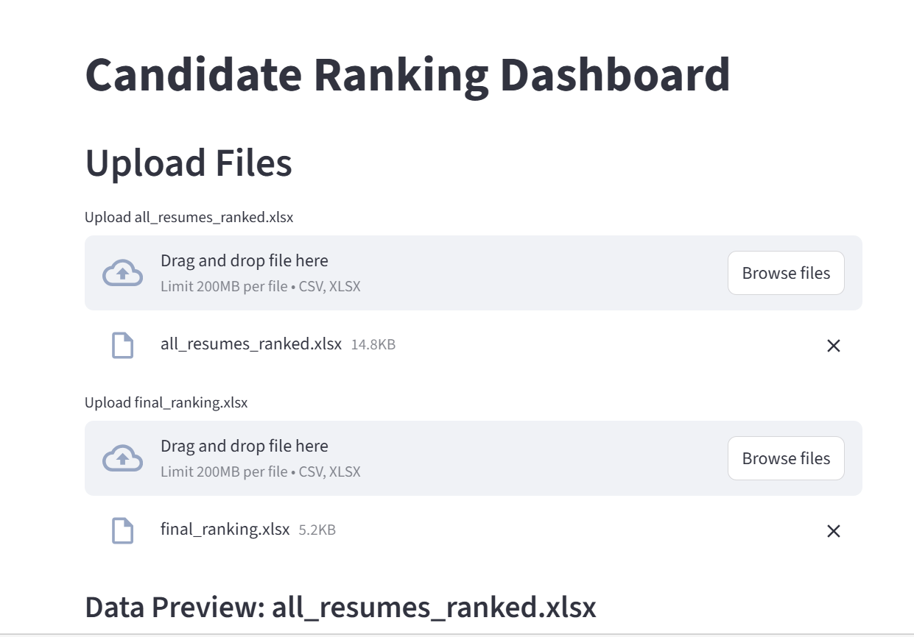
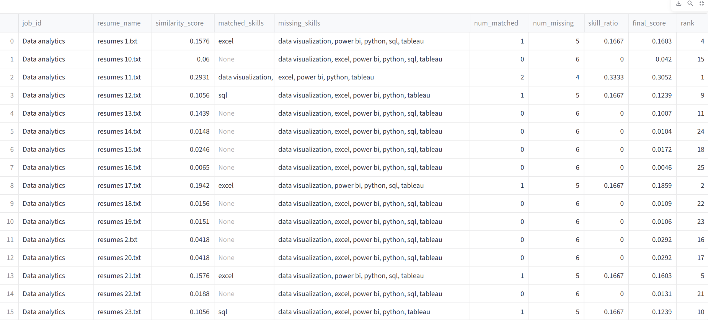
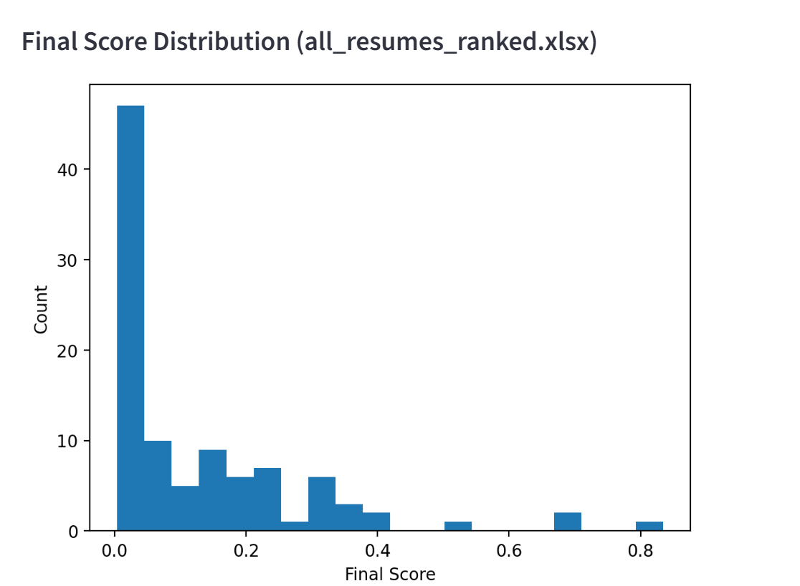
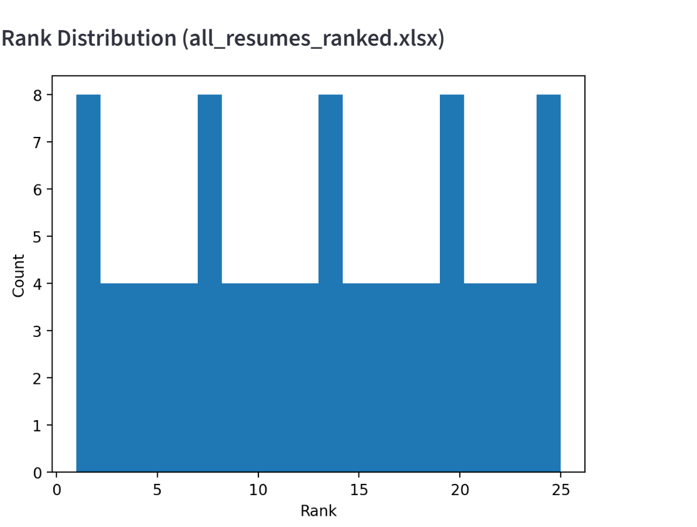
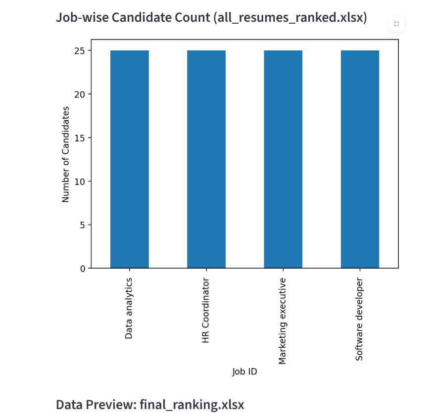
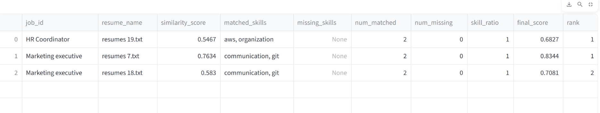
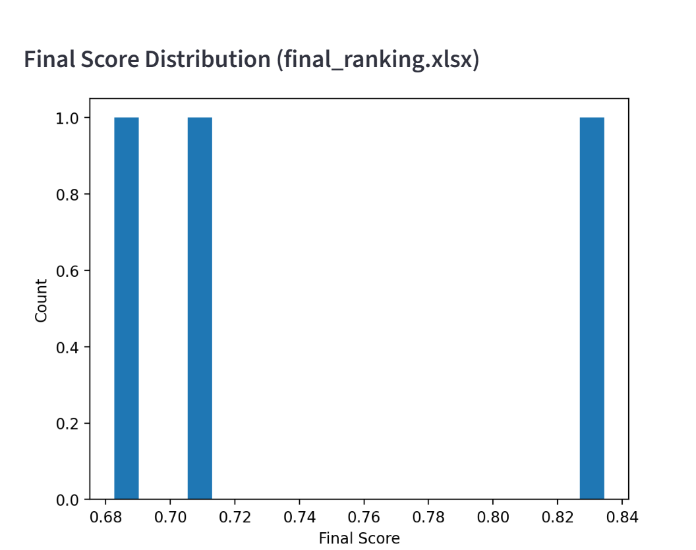
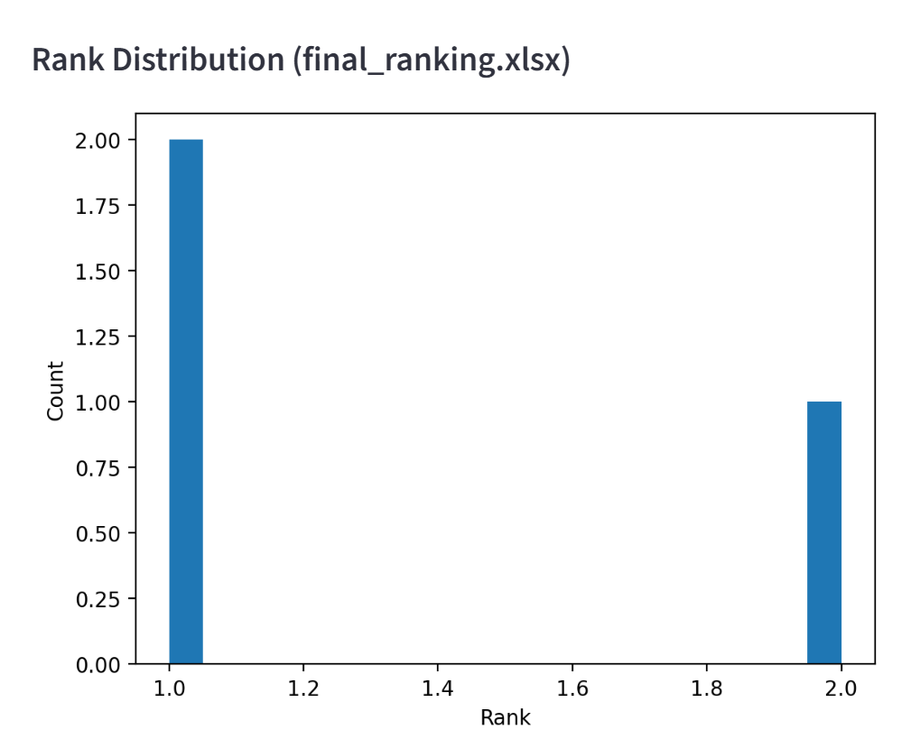
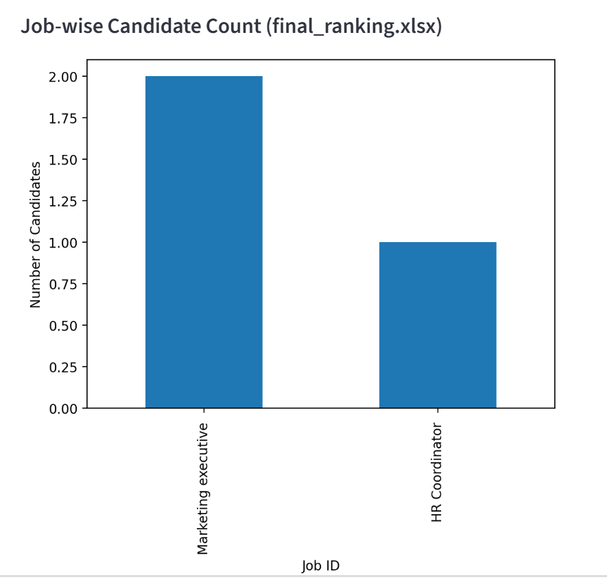

# 🤖 AI Talent Match Engine


## 🌟 Overview

The **AI Talent Match Engine** is a data-driven system designed to automatically match candidate resumes with job descriptions based on skill similarity. It processes resumes and job postings, extracts relevant skills, and evaluates how well each candidate fits the job requirements. The goal is to assist recruiters in identifying the most suitable candidates quickly and efficiently.

The system performs resume parsing, data preprocessing, skill extraction, skill matching, and candidate ranking using Python-based data analysis techniques. An interactive dashboard built with Streamlit allows users to upload resumes and job descriptions, view matching results, and analyze skill gaps through a simple web interface.

---

## 🚀 Live Demo
Experience the interactive dashboard here:
**👉 [AI Talent Match Engine - Live App]  (https://ai-talent-match-engine-7ha8924udbfvjljmaeyxso.streamlit.app)**

---

## 🖥️ Dashboard Gallery
*A comprehensive view of the AI-driven recruitment pipeline and candidate ranking.*

<table style="width:100%">
  <tr>
    <td align="center">><br><b>📊 Candidate Ranking</b></td>
    <td align="center">><br><b>🏆 Match Overview</b></td>
    <td align="center">><br><b>🔍 Final Score Distribution</b></td>
  </tr>
  <tr>
    <td align="center">><br><b>📄 Rank Distribution</b></td>
    <td align="center">><br><b>📈 Job-wise Candidate Count</b></td>
    <td align="center">><br><b>💾 Data Preview of JD</b></td>
  </tr>
  <tr>
    <td align="center">><br><b>🤖 Final Score Distribution of JD</b></td>
    <td align="center">><br><b>📁 Rank Distribution of JD </b></td>
    <td align="center">><br><b>⚙️ Job-wise Candidate Count of JD</b></td>
  </tr>
</table>

---

## ⚙️ System Architecture

```
Resumes (PDF) + Job Descriptions
            │
            ▼
     Text Extraction
            │
            ▼
     Data Preprocessing
            │
            ▼
      Skill Extraction
            │
            ▼
       Skill Matching
            │
            ▼
      Candidate Ranking
            │
            ▼
     Streamlit Dashboard
```

---

## Key Features

* Automated resume parsing
* Job description analysis
* Skill extraction and comparison
* Candidate ranking based on matching score
* Skill gap analysis
* Interactive visualization using Streamlit

---

## Project Structure

```
AI-Talent-Match-Engine
│
├── artifacts/                 # Output files and processed datasets
├── JD/                        # Job descriptions
├── Resumes/                   # Resume PDFs
│
├── phase_3/                   # Skill extraction and ranking modules
├── phase_4/
│   └── app.py                 # Streamlit dashboard
│
├── baseline_match.py
├── clean_preprocess.py
├── extract_jds.py
│
├── requirements.txt
└── README.md
```

---

## Technologies Used

* Python
* Pandas
* NumPy
* Scikit-learn
* PDF processing libraries
* Streamlit

---

## Installation

Clone the repository:

```
git clone https://github.com/Shruti-Kagale/AI-Talent-Match-Engine.git
cd AI-Talent-Match-Engine
```

Install dependencies:

```
pip install -r requirements.txt
```

---

## Running the Dashboard

```
streamlit run phase_4/app.py

Upload all_resumes_ranked.xlsx and final_ranking.xlsx files from artifacts folder.

---

## Future Improvements

* Use NLP models for improved skill extraction
* Add machine learning ranking algorithms
* Expand job role datasets
* Deploy with scalable backend services

---

## Author

Shruti Kagale

AI Talent Match Engine – A project focused on automating recruitment analytics using AI and data processing techniques.
